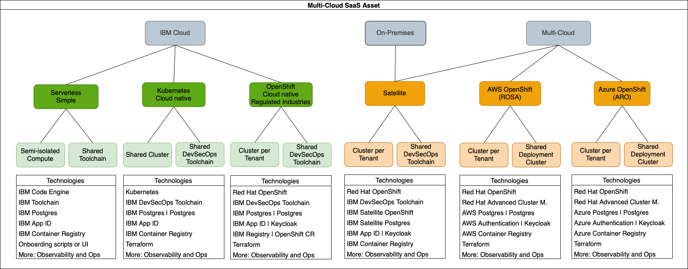

# Multi-tenancy Assets for IBM Clients to build SaaS

This repo contains multi-tenancy assets for IBM clients and partners to build SaaS (Software as a Service).

### Project Structure

* [Introduction](#introduction)
* [Documentation](#documentation)
* [Getting Started](#getting-started)
* [Repositories](#repositories)

## Introduction

A key benefit of the cloud is the ability to deploy software for multiple consumers without having to install it redundantly on-premises. When software is provided as a managed service (SaaS), costs can be reduced for the deployments and the operations of applications. Additionally SaaS can be scaled and new consumers can be added easily.

In order to leverage these advantages, applications need to be designed, so that they can support multiple tenants. Often tenants are not single users, but clients of SaaS providers with their own corporate authentication mechanisms. When running SaaS for multiple tenants, it's often required to keep the workloads isolated from each other for security reasons. For example, typically separate databases are used for tenants.

At the same time common deployment and operation models are required, so that new SaaS versions can be deployed to different tenants in an unique and efficient way.

This project aims to support IBM partners to build SaaS for different platforms including Kubernetes, OpenShift, Serverless, Satellite, AWS and Azure. The used sample application, which contains two containers, is the same one for all platforms. The CI/CD mechanisms slightly differentiate between the platforms.

### Platform Options

The following diagram shows the different platform options. At this point the repo contains the IBM Cloud platforms.

More options are planned to be added. For example with Satellite the SaaS application can be deployed on-premises to client data centers, but managed centrally. Additionally the same SaaS application can be deployed on other managed OpenShift services like AWS ROSA and Azure ARO.

**Serverless on IBM Cloud**

The easiest way to get started is to use serverless. The repo describes how to use IBM Code Engine to run the application logic, IBM App ID for authentication, IBM Postgres for persistence and IBM Toolchain for CI/CD. Scripts are provided to make the setup as easy as possible.

**Managed Kubernetes and OpenShift on IBM Cloud**

For more advanced cloud-native applications Kubernetes and OpenShift can be used. Compute isolation can be done either by sharing clusters and using Kubernetes namespaces/OpenShift projects or by having separate clusters for tenants. For authentication the managed services App ID and Postgres can be used, but they can also be replaced by other managed services or services running within the clusters.

For CI/CD the IBM DevSecOps reference architecture based on IBM Toolchain is used which is also the internal IBM standard and which guarantees compliance for regulated industries.

<kbd></kbd>

### Sample Application

The project comes with a simple e-commerce example application. A SaaS provider might have one client selling books, another one selling shoes.

<kbd></kbd>

## Documentation

* [Introduction](#introduction)
* Development of Microservices
    * [Quarkus Backend Service Code](https://github.com/IBM/multi-tenancy-documentation/blob/main/documentation/development_of_microservices/backend-service-impl.md)
    * [Quarkus Backend Service Container](https://github.com/IBM/multi-tenancy-documentation/blob/main/documentation/development_of_microservices/backend-service-container.md)
    * [Vue.js Frontend Service Code](https://github.com/IBM/multi-tenancy-documentation/blob/main/documentation/development_of_microservices/frontend-service-code.md)
    * [Vue.js Frontend Service Container](https://github.com/IBM/multi-tenancy-documentation/blob/main/documentation/development_of_microservices/frontend-service-container.md)
    * [Externalization of Variables in Backend Microservices](https://github.com/IBM/multi-tenancy-documentation/blob/main/documentation/development_of_microservices/externalization-of-variables-in-backend-microservices.md)
    * [Externalization of Variables in Frontend Microservices](https://github.com/IBM/multi-tenancy-documentation/blob/main/documentation/development_of_microservices/externalization-of-variables-in-frontend-microservices.md)
    * [Local Development of Services](https://github.com/IBM/multi-tenancy-documentation/blob/main/documentation/development_of_microservices/local-development.md)
    * [Authentication Flow (AppID, backend, frontend)](https://github.com/IBM/multi-tenancy-documentation/blob/main/documentation/development_of_microservices/authentication-flow-appip-backend-frontend.md)
* Creation of managed IBM Cloud Services
    * Database
        * [Programmatic Creation of Postgres](https://github.com/IBM/multi-tenancy-documentation/blob/main/documentation/creation-of-managed-ibm-cloud-services/create-postgres.md)
        * [Programmatic Configuration of Postgres including Schema](https://github.com/IBM/multi-tenancy-documentation/blob/main/documentation/creation-of-managed-ibm-cloud-services/create-postgres-schema.md)
    * Authentication
        * [Programmatic Creation of AppID](https://github.com/IBM/multi-tenancy-documentation/blob/main/documentation/creation-of-managed-ibm-cloud-services/create-appid.md)
        * [Programmatic Configuration of AppID](https://github.com/IBM/multi-tenancy-documentation/blob/main/documentation/creation-of-managed-ibm-cloud-services/configure-appid.md)
* Serverless via IBM Code Engine
    * Architecture
    * Initial Setup via Scripts
        1. [Create the instances](https://github.com/IBM/multi-tenancy-documentation/blob/main/documentation/serverless-via-ibm-code-engine/ce-setup-create-the-instances.md)
        2. [Verify the created instances](https://github.com/IBM/multi-tenancy-documentation/blob/main/documentation/serverless-via-ibm-code-engine/ce-verify-the-created-instances.md) 
    * [CI/CD](https://github.com/IBM/multi-tenancy-documentation/blob/main/documentation/serverless-via-ibm-code-engine/serverless-cicd.md)
    * [Onboarding](https://github.com/IBM/multi-tenancy-documentation/blob/main/documentation/serverless-via-ibm-code-engine/code-engine-onboarding.md)
    * [Observability (logging, monitoring, vulnerabilities)](documentation/observability.md)
    * [Billing](https://github.com/IBM/multi-tenancy-documentation/blob/main/documentation/serverless-via-ibm-code-engine/code-engine-billing.md)
    * [Clean Up](https://github.com/IBM/multi-tenancy-documentation/blob/main/documentation/serverless-via-ibm-code-engine/ce_clean_up.md)
* Kubernetes via IBM Kubernetes Service and IBM OpenShift
    * Architecture
    * [Initial Setup via Scripts](https://github.com/IBM/multi-tenancy-documentation/blob/main/documentation/automation/terraform/3-Provisionning-A-Kubernetes-Based-Infrastructure.md)
    * CI/CD DevSecOps
        * [Overview](https://github.com/IBM/multi-tenancy-documentation/blob/main/documentation/kubernetes-via-ibm-kubernetes-service-and-ibm-openshift/devsecops-overview.md)
        * CI
            * [CI pull request](documentation/ci-pull-request.md)
            * [CI pipeline](documentation/ci-pipeline.md)
        * CD
            * [CD pull request](documentation/cd-pull-request.md)
            * [CD pipeline](documentation/cd-pipeline.md)
        * [Security and Compliance](documentation/security-and-compliance.md)
        * Setup of the Toolchains
            * [CI Toolchains](https://github.com/IBM/multi-tenancy-documentation/blob/main/documentation/k8s/3-ci-cd/README_ci.md)
            * [CD Toolchains](https://github.com/IBM/multi-tenancy-documentation/blob/main/documentation/k8s/3-ci-cd/README_cd.md)
    * [Onboarding](documentation/k8s-onboarding.md)
    * [Observability (logging, monitoring, vulnerabilities)](documentation/observability.md)
    * [Billing](documentation/k8s-billing.md)

## Repositories

This repo is the 'parent repo' including documentation and global configuration. The other four repos contain the implementation of the microservices and the serverless pipelines.

* [multi-tenancy](https://github.com/IBM/multi-tenancy) - this repo (parent repo)
    * Overview documentation
    * Global and tenant specific application configuration
    * CD pipeline
    * Scripts to deploy cloud services/infrastructure

* [multi-tenancy-backend](https://github.com/IBM/multi-tenancy-backend) - backend microservice
    * Code
    * CI pipeline

* [multi-tenancy-frontend](https://github.com/IBM/multi-tenancy-frontend) - frontend microservice   
    * Code
    * CI pipeline

* [multi-tenancy-serverless-ci-cd](https://github.com/IBM/multi-tenancy-serverless-ci-cd) - CI and CD pipelines for serverless

## Getting Started

The easiest way to get started is to set up the sample application for two tenants on the IBM Cloud using serverless technology. The following diagram describes the serverless architecture of the simple e-commerce application which has two images (backend and frontend).

Isolated Compute:
* One frontend container per tenant
* One backend container per tenant
* One App ID instance per tenant
* One Postgres instance (with one database) per tenant

Shared CI/CD:
* One code base for frontend and backend services
* One image for frontend service
* One image for backend service
* One toolchain for all tenants (with four pipelines)

<kbd></kbd>

Used IBM Services:
* IBM Code Engine
* IBM Container Registry
* IBM App ID
* IBM Postgres
* IBM Toolchain

Used Technologies:
* Quarkus
* Vue.js and nginx
* Bash scripts

**Initial Deployment Scripts**

Scripts and provided to set up all services and the application automatically. Follow this [step by step guide](documentation/getting-started.md) to set up everything using local bash scripts.

**Deployments of Updates via CI/CD**

Additionally pipelines are provided to re-deploy the backend and frontend services when their implementations have changed. Follow this [step by step guide](documentation/serverless-cicd.md) to set up the pipelines.

