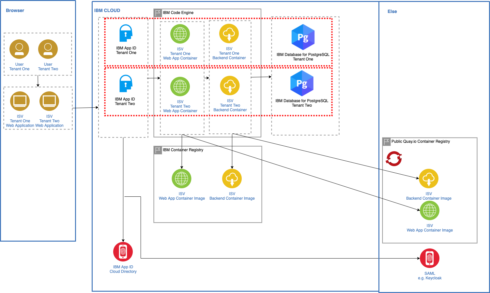

# Multi-tenancy Assets for IBM Partners to build SaaS

This repo contains multi-tenancy assets for IBM partners to build SaaS.

### Project Structure

* [Project Overview](#project-overview)
* [Repositories](#repositories)
* [Serverless Architecture](#serverless-architecture)
* [Initial Setup](#initial-setup)
* [Simple Pipelines to update Serverless Application](#simple-pipelines-to-update-serverless-application)
* [Develop Services locally](#develop-backend-service-locally)
* [Draft Documentation](https://ibm.github.io/multi-tenancy/)


## Project Overview

The project aims to support partners to build SaaS for different platforms including Serverless, OpenShift and Satellite. As first step the repo contains an example how to run SaaS via serverless capabilities on the IBM Cloud (lower left corner).

<kbd></kbd>

The project comes with a simple e-commerce example application. A SaaS provider might have one client selling books, another one selling shoes.

<kbd></kbd>

## Repositories

This repo is the 'parent repo' including documentation and global configuration.

* [multi-tenancy](https://github.com/IBM/multi-tenancy) - parent repo
1) Documentation
2) Global configuration
3) CD pipeline
4) Scripts

* [multi-tenancy-backend](https://github.com/IBM/multi-tenancy-backend) - backend microservice
1) Code
2) CI pipeline

* [multi-tenancy-frontend](https://github.com/IBM/multi-tenancy-frontend) - frontend microservice
1) Code
2) CI pipeline

* [multi-tenancy-serverless-ci-cd](https://github.com/IBM/multi-tenancy-serverless-ci-cd) - CI and CD pipelines for serverless


## Serverless Architecture

Isolated Compute:
* One frontend container per tenant
* One backend container per tenant
* One App ID instance per tenant
* One Postgres instance (with one database) per tenant

Shared CI/CD:
* One code base for frontend and backend services
* One image for frontend service
* One image for backend service
* One toolchain for all tenants

<kbd></kbd>


## Initial Setup

The initial setup is only for the serverless part in Code Engine, with the objective to provide you an initial understanding of the application and providing a working environment with the example application and it components.
### Step 1: Clone the repositories


```sh
$ git clone https://github.com/IBM/multi-tenancy 
$ git clone https://github.com/IBM/multi-tenancy-backend
$ git clone https://github.com/IBM/multi-tenancy-frontend && cd multi-tenancy
$ ROOT_FOLDER=$(pwd)
```

### Step 2 : Verify the prerequisites for running the installation

```sh
$ cd $ROOT_FOLDER/installapp
$ sh ./ce-check-prerequisites.sh
```

The script stops when it notices any prerequisite is missing.

Example output:

```sh
Check prereqisites
1. Verify grep
- Grep is installed: grep (BSD grep, GNU compatible) 2.6.0-FreeBSD !
2. Verify awk
- AWK is installed: awk version 20200816 !
3. Verify cURL
- cURL is installed: curl 7.77.0 (x86_64-apple-darwin21.0) libcurl/7.77.0 (SecureTransport) LibreSSL/2.8.3 zlib/1.2.11 nghttp2/1.42.0
Release-Date: 2021-05-26
Protocols: dict file ftp ftps gopher gophers http https imap imaps ldap ldaps mqtt pop3 pop3s rtsp smb smbs smtp smtps telnet tftp 
Features: alt-svc AsynchDNS GSS-API HSTS HTTP2 HTTPS-proxy IPv6 Kerberos Largefile libz MultiSSL NTLM NTLM_WB SPNEGO SSL UnixSockets !
4. Verify jq
- JQ is installed: jq-1.6 !
5. Verify libpq (psql)
- libpq (psql) is installed: psql (PostgreSQL) 14.0 !
6. Verify Docker
- Docker is installed: Docker version 20.10.11, build dea9396 !
7. Verify ibmcloud cli
- IBM Cloud CLI is installed: ibmcloud version 2.3.0+26fbf88-2021-12-09T18:02:50+00:00 !
8. Verify ibmcloud plugin cloud-databases
- IBM Cloud Plugin 'cloud-databases' is installed: cloud-databases !
9. Verify ibmcloud plugin code-engine
- IBM Cloud Plugin 'code-engine' is installed: code-engine[ce] !
10. Verify ibmcloud plugin container-registry
- IBM Cloud Plugin 'container-registry' is installed: container-registry !
Success! All prerequisites verified!
```

You need the following tools installed locally to run the script above:

* [ibmcloud cli](https://cloud.ibm.com/docs/cli?topic=cli-install-ibmcloud-cli)
* [ibmcloud plugin code-engine](https://cloud.ibm.com/docs/codeengine?topic=codeengine-install-cli)
* [ibmcloud plugin cloud-databases](https://cloud.ibm.com/docs/databases-cli-plugin?topic=databases-cli-plugin-cdb-reference)
* [ibmcloud plugin container-registry](https://cloud.ibm.com/docs/Registry?topic=container-registry-cli-plugin-containerregcli)
* [Docker](https://docs.docker.com/get-docker/)
* [sed](https://en.wikipedia.org/wiki/Sed)
* [jq](https://lzone.de/cheat-sheet/jq)
* [grep](https://en.wikipedia.org/wiki/Grep)
* [libpq (psql)](https://www.postgresql.org/docs/9.5/libpq.html) 
* [cURL](https://curl.se/)
* [AWK](https://en.wikipedia.org/wiki/AWK)

### Step 3: Define the configuration for the tenants you want to install

Define the global configuration in [global.json](configuration/global.json). It includes `IBM Cloud settings` such as region and resource group, `container registry information` and `image information`.

Additionally define the same global configuration in [tenants-config](installapp/tenants-config). Note that this step will not be necessary sometime soon.

For each tenant define tenant-specific configuration in the folder 'configuration/tenants'. That configuration contains for example `App ID information`. `Postgres database information`, `application instance information`, and `Code Engine information`. Here you find an example configuration [tenant-a.json](configuration/tenants/tenant-a.json).

Additionally define the same configuration in [tenants-config](installapp/tenants-config). Note that this step will not be necessary sometime soon.

### Step 4: Start the installation

To create all components for the two sample tenants configurations, run the following commands:

```sh
$ cd $ROOT_FOLDER/installapp
$ ibmcloud login --sso
$ sh ./ce-create-two-tenancies.sh
```


The script takes roughly 30 minutes. You will be asked to review some configurations and press enter to move forward in some steps.
The script will stop in some situations when it discovers a problem during the setup.

After this the URL of the frontend applications will be displayed. For both tenants the following test user can be used to log in:

User: thomas@example.com. Password: thomas4appid

### Step 5: Understand the details of the initial installation bash scripts

We use three bash scripts for the initial installation. The following diagram shows the simplified dependencies of these bash scripts used to create two tenants of the example application on IBM Cloud in Code Engine.


The scripts creating two tenants:

* Two Code Engine projects with two applications one frontend and one backend.
* Two App ID instance to provide a basic authentication and authorization for the two tenants.
* Two Postgres databases for the two tenants.

The table contains the script and the responsibility of the scripts.

| Script | Responsibility |
|---|---|
| [`ce-create-two-tenancies.sh`](https://github.com/IBM/multi-tenancy/blob/main/installapp/ce-create-two-tenancies.sh) | Build the container images therefor it invokes the bash script [`ce-build-images-ibm-docker.sh`](https://github.com/IBM/multi-tenancy/blob/main/installapp/ce-build-images-ibm-docker.sh) and uploads the images to the IBM Cloud container registry. It also starts the creation of the tenant application instance, therefor it invokes the bash script [`ce-install-application.sh`](https://github.com/IBM/multi-tenancy/blob/main/installapp/ce-install-application.sh) twice. |
| [`ce-build-images-ibm-docker.sh`](https://github.com/IBM/multi-tenancy/blob/main/installapp/ce-build-images-ibm-docker.sh) | Creates two container images based on the given parameters for the backend and frontend image names. |
| [`ce-install-application.sh`](https://github.com/IBM/multi-tenancy/blob/main/installapp/ce-install-application.sh) | Creates and configures a `Code Engine project`. The configuration of the Code Engine project includes the `creation of the application`, the `IBM Cloud Container Registry access` therefor it also creates a `IBM Cloud API` and it creates the `secrets` for the needed parameter for the running applications. It creates an `IBM Cloud App ID instance` and configures this instance that includes the `application`, `redirects`, `login layout`, `scope`, `role` and `user`. It also creates an `IBM Cloud Postgres` database instance and creates the needed example data with tables inside the database. |

### Step 6: Verify the setup by using following url [`https://cloud.ibm.com/resources`](https://cloud.ibm.com/resources)

In resource list of the IBM Cloud UI, insert as filter for **name** the value `multi`. Now you should see following in your resource list:


### Step 7: Open App ID instance for `tenant a` and inspect the configuration

Open following URL <https://cloud.ibm.com/resources>


### Step 8: Open Code Engine project for `tenant a` and inspect the configuration

### Step 9: Open the frontend application for `tenant a` in the Code Engine project


### Step 10: Click on URL and logon to the frontend application using **username** `thomas@example.com` and **password** `thomas4appid`


### Step 11: Clean-up

The clean-up reuses the configuration json files you defined for the setup/installatation.

To delete all created resource you execute following commands:

```sh
$ cd $ROOT_FOLDER/installapp
$ ibmcloud login --sso
$ sh ./ce-clean-up-two-tenancies.sh
```

The table contains the script and the responsibility of the scripts.

| Script | Responsibility |
|---|---|
| [`ce-clean-up-two-tenancies.sh`](https://github.com/IBM/multi-tenancy/blob/main/installapp/ce-clean-up-two-tenancies.sh) | It starts the clean-up for the tenant application instances, therefor it invokes the bash script [`ce-clean-up.sh`](https://github.com/IBM/multi-tenancy/blob/main/installapp/ce-clean-up.sh) twice with the json configuration files as parameters. |
| [`ce-clean-up.sh`](https://github.com/IBM/multi-tenancy/blob/main/installapp/ce-clean-up.sh) | Deletes all created resouce for the two tenants. |

## Simple Pipelines to update Serverless Application

In order to update the backend and frontend containers on Code Engine, simple CI/CD pipelines are provided.

* pipeline-backend: Builds the backend image and triggers the  deployment pipelines for all tenants
* pipeline-backend-tenant: Deploys the backend container for one tenant
* pipeline-frontend: Builds the frontend image and triggers the  deployment pipelines for all tenants
* pipeline-frontend-tenant: Deploys the frontend container for one tenant

The pipelines will use the configuration from the [configuration](configuration) directory in which global and tenant specific settings need to be defined. When the IBM Toolchain with the four pipelines is created, the four github.com/IBM/multi-tenancy* repos are cloned to your GitLab user accounts on the IBM Cloud.

The toolchain can be created simply by invoking this URL: https://cloud.ibm.com/devops/setup/deploy?repository=https://github.com/ibm/multi-tenancy-serverless-ci-cd

Note that on the first page the region and the resource group need to be the same ones as defined in [configuration/global.json](configuration/global.json). Leave all other default values.

On the second page you only need to create an API key. Leave all other default values.

After you've created the toolchain, change your configuration in the 'configuration' directory of your GitLab repo. Then you can invoke the first pipeline "pipeline-backend" manually. Once the image has been built, it will trigger the deployment pipelines.

The "pipeline-frontend" pipeline will only work after the backend has been deployed since the frontend containers need to know the endpoints of the backend containers.


## Develop Backend Service locally

To run the backend service locally, a [managed Postgres](https://cloud.ibm.com/databases/databases-for-postgresql/create) instance needs to be created first. After this you need to define four variables in local.env. See local.env.template for more:
- POSTGRES_USERNAME
- POSTGRES_PASSWORD
- POSTGRES_URL
- POSTGRES_CERTIFICATE_FILE_NAME

Additionally you need to copy the certificate file in code/service-catalog/src/main/resources/certificates. As file name use the Postgres username.

For the authentication a [App ID](https://www.ibm.com/cloud/app-id) instance is required. Copy the two settings in local.env:
- APPID_CLIENT_ID (note: this is not the client id in the secrets, but in the application settings)
- APPID_DISCOVERYENDPOINT

For IBMers only: You can re-use existing services by using these [configuration](https://github.ibm.com/niklas-heidloff/multi-tenancy-credentials) files.

```
$ git clone https://github.com/IBM/multi-tenancy.git
$ git clone https://github.com/IBM/multi-tenancy-backend.git
$ cd multi-tenancy
$ ROOT_FOLDER=$(pwd)
$ cp certificate ${root_folder}/code/service-catalog/src/main/resources/certificates/
$ cp template.local.env local.env
$ vi local.env
```

Run the backend service locally via Maven:

```
$ sh scripts/run-locally-backend.sh
```

Or run the backend service locally via container (podman):

```
$ sh scripts/run-locally-container-backend.sh
```

Invoke http://localhost:8081/category/2/products.

(User: thomas@example.com. Password: thomas4appid)
