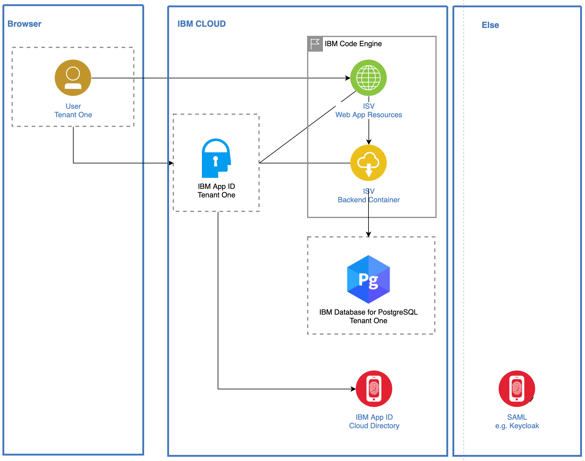

# Multi tenancy - architecture and projects

**------------------**
**UNDER CONSTRUCTION**
**------------------**

### Multi-tenancy projects 

* [Serverless](https://github.com/karimdeif/multi-tenancy)
* [OpenShift](https://github.com/kleniu/openshift-multi-tenancy)
* [Satellite]()

### Target architecture `serverless`:

* One frontend per tenant, one business logic per tenant. This is a simplified diagram containing the used elements and dependencies.

* Just a single tenant. This is a simplified diagram containing the used elements and dependencies.

### Technology Used

The example ecommerce mircorservices application is build on following `technologies/services/tools/frameworks`.

  * [Microservices architecture](https://en.wikipedia.org/wiki/Microservices)
  * [OpenID Connect](https://openid.net/connect/)
  * [Jakarta EE](https://jakarta.ee/)
  * [MicroProfile](https://microprofile.io/)

---

  * [IBM Cloud Code Engine](https://cloud.ibm.com/docs/codeengine?topic=codeengine-about)
  * [Postgres](https://cloud.ibm.com/databases/databases-for-postgresql/create)
  * [AppID](https://www.ibm.com/de-de/cloud/app-id)
  * [Toolchain](https://cloud.ibm.com/docs/ContinuousDelivery?topic=ContinuousDelivery-toolchains_getting_started)

---

  * [Quarkus](https://quarkus.io/ingress)
  * [Vue.js](https://vuejs.org/)

---

  * [NGINX](https://www.nginx.com/)
  * [git 2.24.1 or higher](https://git-scm.com/book/en/v2/Getting-Started-Installing-Git)
  * [yarn 1.22.4 or higher](https://yarnpkg.com)
  * [Node.js v14.6.0 or higher](https://nodejs.org/en/)
  * [Apache Maven 3.6.3](https://maven.apache.org/ref/3.6.3/maven-embedder/cli.html)
  * [Quay](https://quay.io/)
  * [Tekton](https://tekton.dev/)

---

  * [Bash](https://en.wikipedia.org/wiki/Bash_(Unix_shell))
  * [jq](https://lzone.de/cheat-sheet/jq)
  * [sed](https://en.wikipedia.org/wiki/Sed)
  * [grep](https://en.wikipedia.org/wiki/Grep)
  