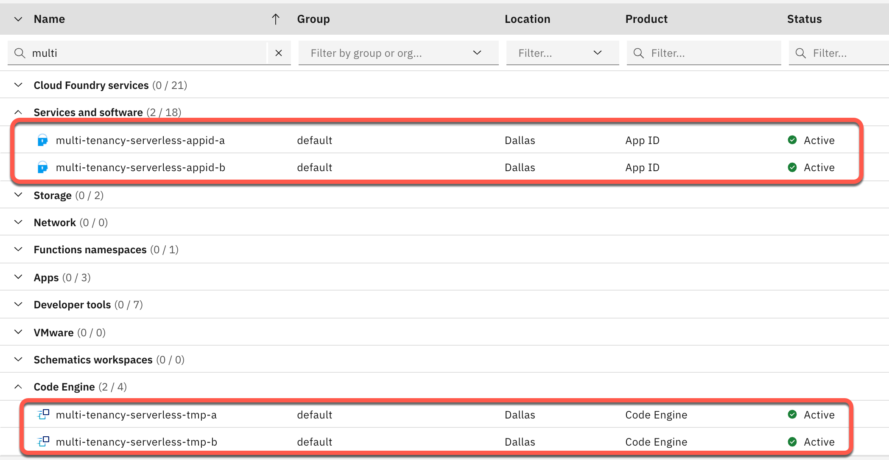
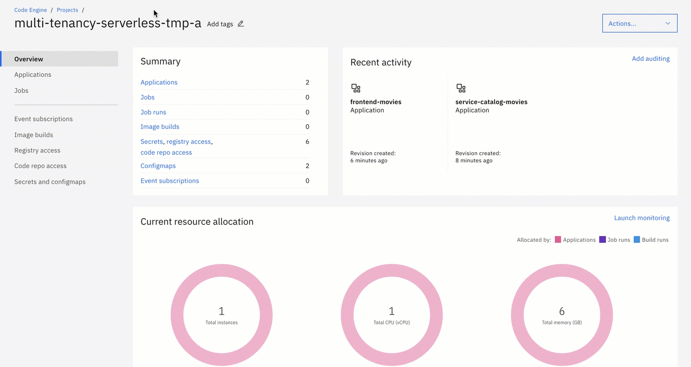
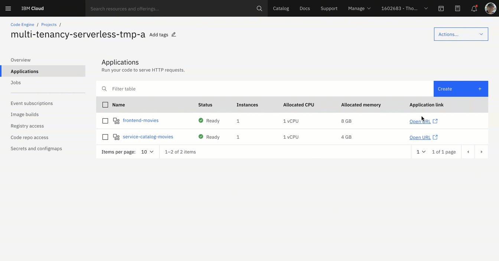

# Getting Started


The initial setup is only for the serverless part in Code Engine, with the objective to provide you an initial understanding of the application and providing a working environment with the example application and it components.
### Step 1: Clone the repositories


```sh
$ git clone https://github.com/IBM/multi-tenancy 
$ git clone https://github.com/IBM/multi-tenancy-backend
$ git clone https://github.com/IBM/multi-tenancy-frontend && cd multi-tenancy
$ ROOT_FOLDER=$(pwd)
```

### Step 2 : Verify the prerequisites for running the installation

```sh
$ cd $ROOT_FOLDER/installapp
$ sh ./ce-check-prerequisites.sh
```

The script stops when it notices any prerequisite is missing.

Example output:

```sh
Check prereqisites
1. Verify grep
- Grep is installed: grep (BSD grep, GNU compatible) 2.6.0-FreeBSD !
2. Verify awk
- AWK is installed: awk version 20200816 !
3. Verify cURL
- cURL is installed: curl 7.77.0 (x86_64-apple-darwin21.0) libcurl/7.77.0 (SecureTransport) LibreSSL/2.8.3 zlib/1.2.11 nghttp2/1.42.0
Release-Date: 2021-05-26
Protocols: dict file ftp ftps gopher gophers http https imap imaps ldap ldaps mqtt pop3 pop3s rtsp smb smbs smtp smtps telnet tftp 
Features: alt-svc AsynchDNS GSS-API HSTS HTTP2 HTTPS-proxy IPv6 Kerberos Largefile libz MultiSSL NTLM NTLM_WB SPNEGO SSL UnixSockets !
4. Verify jq
- JQ is installed: jq-1.6 !
5. Verify libpq (psql)
- libpq (psql) is installed: psql (PostgreSQL) 14.0 !
6. Verify Docker
- Docker is installed: Docker version 20.10.11, build dea9396 !
7. Verify ibmcloud cli
- IBM Cloud CLI is installed: ibmcloud version 2.3.0+26fbf88-2021-12-09T18:02:50+00:00 !
8. Verify ibmcloud plugin cloud-databases
- IBM Cloud Plugin 'cloud-databases' is installed: cloud-databases !
9. Verify ibmcloud plugin code-engine
- IBM Cloud Plugin 'code-engine' is installed: code-engine[ce] !
10. Verify ibmcloud plugin container-registry
- IBM Cloud Plugin 'container-registry' is installed: container-registry !
Success! All prerequisites verified!
```

You need the following tools installed locally to run the script above:

* [ibmcloud cli](https://cloud.ibm.com/docs/cli?topic=cli-install-ibmcloud-cli)
* [ibmcloud plugin code-engine](https://cloud.ibm.com/docs/codeengine?topic=codeengine-install-cli)
* [ibmcloud plugin cloud-databases](https://cloud.ibm.com/docs/databases-cli-plugin?topic=databases-cli-plugin-cdb-reference)
* [ibmcloud plugin container-registry](https://cloud.ibm.com/docs/Registry?topic=container-registry-cli-plugin-containerregcli)
* [Docker](https://docs.docker.com/get-docker/)
* [sed](https://en.wikipedia.org/wiki/Sed)
* [jq](https://lzone.de/cheat-sheet/jq)
* [grep](https://en.wikipedia.org/wiki/Grep)
* [libpq (psql)](https://www.postgresql.org/docs/9.5/libpq.html) 
* [cURL](https://curl.se/)
* [AWK](https://en.wikipedia.org/wiki/AWK)

### Step 3: Define the configuration for the tenants you want to install

Define the global configuration in [global.json](configuration/global.json). It includes `IBM Cloud settings` such as region and resource group, `container registry information` and `image information`.

Additionally define the same global configuration in [tenants-config](installapp/tenants-config). Note that this step will not be necessary sometime soon.

For each tenant define tenant-specific configuration in the folder 'configuration/tenants'. That configuration contains for example `App ID information`. `Postgres database information`, `application instance information`, and `Code Engine information`. Here you find an example configuration [tenant-a.json](configuration/tenants/tenant-a.json).

Additionally define the same configuration in [tenants-config](installapp/tenants-config). Note that this step will not be necessary sometime soon.

### Step 4: Configure `IBM Cloud Container Registry Namespace` and `Code Engine project names`

>The values for the names of the `IBM Cloud Container Registry Namespace` and the `IBM Cloud Code Engine` project must unique in IBM Cloud for a region! 

To avoid problems during running the setup, please configure these name to your needs. 

1. Configure your `IBM Cloud Container Registry Namespace name`

In the [global.json](configuration/global.json) file you need to change the value for the IBM Cloud Container Registry Namespace name to something like `multi-tenancy-example-mypostfix`.

```json
  "REGISTRY": {
    "URL": "de.icr.io",
    "NAMESPACE": "multi-tenancy-example-[YOUR_POSTFIX]",
    "SECRET_NAME": "multi.tenancy.cr.sec",
    "TAG": "v2"
  },
```

2. Configure your `Code Engine project names` for the two tenants

In the [tenant-a.json](configuration/tenants/tenant-a.json) files you need to change the value for the `Code Engine project` to something like `multi-tenancy-example-mypostfix`.

* `tenant-a.json`: `multi-tenancy-serverless-a-mypostfix`

```json
  "CODE_ENGINE": {
    "PROJECT_NAME": "multi-tenancy-serverless-a-[YOUR_POSTFIX]"
  }
```

* `tenant-b.json`: `multi-tenancy-serverless-a-mypostfix`

```json
  "CODE_ENGINE": {
    "PROJECT_NAME": "multi-tenancy-serverless-b-[YOUR_POSTFIX]"
  }
```

### Step 5: Start the installation

To create all components for the two sample tenants configurations, run the following commands:

```sh
$ cd $ROOT_FOLDER/installapp
$ ibmcloud login --sso
$ sh ./ce-create-two-tenancies.sh
```


The script takes roughly 30 minutes. You will be asked to review some configurations and press enter to move forward in some steps.
The script will stop in some situations when it discovers a problem during the setup.

After this the URL of the frontend applications will be displayed. For both tenants the following test user can be used to log in:

User: thomas@example.com. Password: thomas4appid

### Step 6: Understand the details of the initial installation bash scripts

We use three bash scripts for the initial installation. The following diagram shows the simplified dependencies of these bash scripts used to create two tenants of the example application on IBM Cloud in Code Engine.


The scripts creating two tenants:

* Two Code Engine projects with two applications one frontend and one backend.
* Two App ID instance to provide a basic authentication and authorization for the two tenants.
* Two Postgres databases for the two tenants.

The table contains the script and the responsibility of the scripts.

| Script | Responsibility |
|---|---|
| [`ce-create-two-tenancies.sh`](https://github.com/IBM/multi-tenancy/blob/main/installapp/ce-create-two-tenancies.sh) | Build the container images for the frontend and backend, therefor it invokes the bash script [`ce-build-images-ibm-docker.sh`](https://github.com/IBM/multi-tenancy/blob/main/installapp/ce-build-images-ibm-docker.sh) and uploads the images to the IBM Cloud container registry. It also starts the creation of the tenant application instance, therefor it invokes the bash script [`ce-install-application.sh`](https://github.com/IBM/multi-tenancy/blob/main/installapp/ce-install-application.sh) twice. |
| [`ce-build-images-ibm-docker.sh`](https://github.com/IBM/multi-tenancy/blob/main/installapp/ce-build-images-ibm-docker.sh) | Creates two container images based on the given parameters for the backend and frontend image names. |
| [`ce-install-application.sh`](https://github.com/IBM/multi-tenancy/blob/main/installapp/ce-install-application.sh) | Creates and configures a `Code Engine project`. The configuration of the Code Engine project includes the `creation of the application`, the `IBM Cloud Container Registry access` therefor it also creates a `IBM Cloud API` and it creates the `secrets` for the needed parameter for the running applications. It creates an `IBM Cloud App ID instance` and configures this instance that includes the `application`, `redirects`, `login layout`, `scope`, `role` and `user`. It also creates an `IBM Cloud Postgres` database instance and creates the needed example data with tables inside the database. |

### Step 7: Verify the setup by using following url [`https://cloud.ibm.com/resources`](https://cloud.ibm.com/resources)

In resource list of the IBM Cloud UI, insert as filter for **name** the value `multi`. Now you should see following in your resource list:



### Step 8: Open App ID instance for `tenant a` and inspect the configuration

Open following URL <https://cloud.ibm.com/resources>


### Step 9: Open Code Engine project for `tenant a` and inspect the project

Open following link in a browser:

```sh
https://cloud.ibm.com/codeengine/projects
```
### Step 10: Open the frontend application for `tenant a` in the Code Engine project



### Step 11: Click on URL and log on to the frontend application using **username** `thomas@example.com` and **password** `thomas4appid`



### Step 12: Clean-up

The clean-up reuses the configuration json files you defined for the setup/installatation.

To delete all created resource you execute following commands:

```sh
$ cd $ROOT_FOLDER/installapp
$ ibmcloud login --sso
$ sh ./ce-clean-up-two-tenancies.sh
```

The table contains the script and the responsibility of the scripts.

| Script | Responsibility |
|---|---|
| [`ce-clean-up-two-tenancies.sh`](https://github.com/IBM/multi-tenancy/blob/main/installapp/ce-clean-up-two-tenancies.sh) | It starts the clean-up for the tenant application instances, therefor it invokes the bash script [`ce-clean-up.sh`](https://github.com/IBM/multi-tenancy/blob/main/installapp/ce-clean-up.sh) twice with the json configuration files as parameters. |
| [`ce-clean-up.sh`](https://github.com/IBM/multi-tenancy/blob/main/installapp/ce-clean-up.sh) | Deletes all created resouce for the two tenants. |
