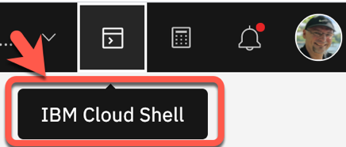
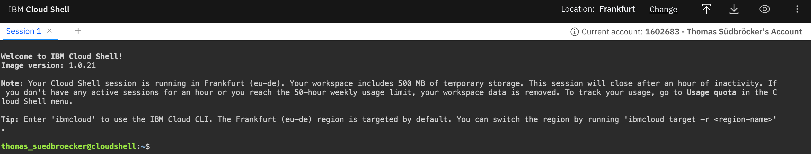

# Lab 2: Open `IBM Cloud Shell`

#### Step 1: Open the `IBM Cloud Shell`

When using the IBM Cloud Shell, no client-side setup is required for this workshop, it comes with all necessary CLIs (command line tools).

Use following link to directly open the `IBM Cloud Shell`.

<https://cloud.ibm.com/shell>

In your browser, login to the [IBM Cloud](https://cloud.ibm.com) Dashboard and open the IBM Cloud Shell from here:

_Note:_ Your workspace includes 500 MB of temporary storage. This session will close after an hour of inactivity. If you don't have any active sessions for an hour or you reach the 50-hour weekly usage limit, your workspace data is removed.

#### Step 2: Verify `IBM Cloud Shell`

Now you are logged on with your IBM Cloud account.

