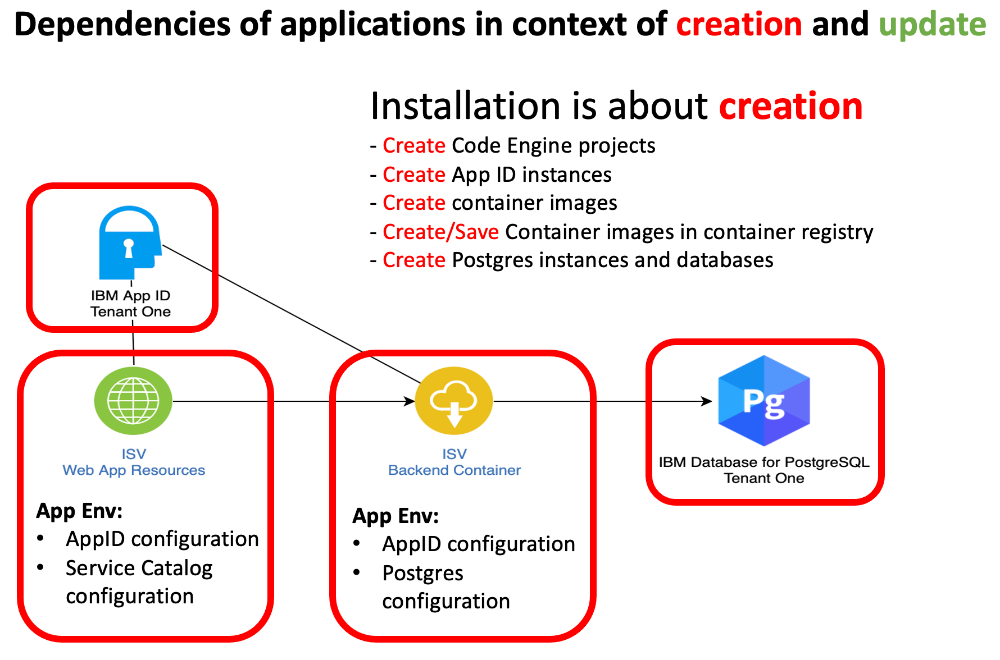
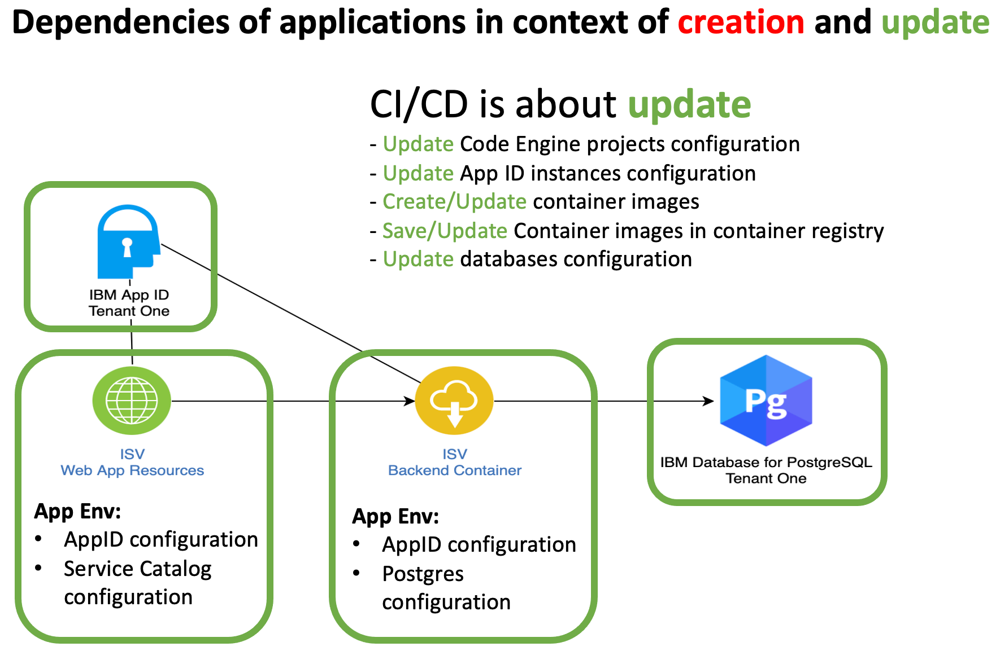

# Objectives for sprint in week 41 `serverless`

These are the main three objectives for this sprint.

* **Running simple ecommerce application on Code Engine**
* **Automation of the deployment**
* **Documentation of the setup**

#### 1 **Running simple ecommerce application on Code Engine**

  * App ID is configured **(DONE)**
  * Frontend is integrated with AppID **(DONE)**
      * Externalize configuration for Service Catalog **(DONE)**
      * Externalize configuration for AppID **(DONE)**
  * Backend is integrated with AppID **(PENDING)**
      * Externalize configuration for AppID **(PENDING)**
  * Backend is integrated postgres **(IN PROGRESS)**
      * Externalize configuration for Postgress **(IN PROGRESS)**
  * Postgres is setup **(DONE)**

#### 2  **Automation of the deployment**
      
  * Installation and setup is more about **creation** **(IN PROGRESS)** ([link to the bash script for initial creation](https://github.com/karimdeif/multi-tenancy/blob/main/installapp/ce-create-two-tenantcies.sh))
  * CI/CD is more about **update** **(IN PROGRESS)** ([link to the Toolchain with the tekton pipeline](https://cloud.ibm.com/devops/toolchains/92bb1c04-7f8a-4984-ab8a-2da143a96476?env_id=ibm:yp:us-south))

##### 2.1 **Differences between creation and update**

  * Creation ([link to the bash script for initial creation](https://github.com/karimdeif/multi-tenancy/blob/main/installapp/ce-create-two-tenantcies.sh)) This is a simplified diagram containing the used elements and dependencies.
 
  

  * Update ([link to the Toolchain with the tekton pipeline](https://cloud.ibm.com/devops/toolchains/92bb1c04-7f8a-4984-ab8a-2da143a96476?env_id=ibm:yp:us-south)) This is a simplified diagram containing the used elements and dependencies.

  

##### 2.2 **Used CLIs and APIs for the automation**

* IBM Cloud Services

    * [IBM AppID REST API](https://us-south.appid.cloud.ibm.com/swagger-ui)
    * [IBM Cloud CLI](https://cloud.ibm.com/docs/cli?topic=cli-getting-started)
    * [IBM Code Engine CLI](https://cloud.ibm.com/docs/codeengine?topic=codeengine-cli)
    * [IBM Cloud databases CLI](https://cloud.ibm.com/docs/databases-cli-plugin?topic=databases-cli-plugin-cdb-reference)
    * [IBM Cloud Container Registry CLI](https://cloud.ibm.com/docs/Registry?topic=container-registry-cli-plugin-containerregcli&locale=de)

* Bash automation

    * [Bash](https://en.wikipedia.org/wiki/Bash_(Unix_shell))
    * [jq](https://lzone.de/cheat-sheet/jq)
    * [sed](https://en.wikipedia.org/wiki/Sed)
    * [grep](https://en.wikipedia.org/wiki/Grep)

#### 3  **Documentation of the setup**

  * Automation setup **(in progress)**
  * Manual setup **(pending)**
  * Workshop **(pending)**
